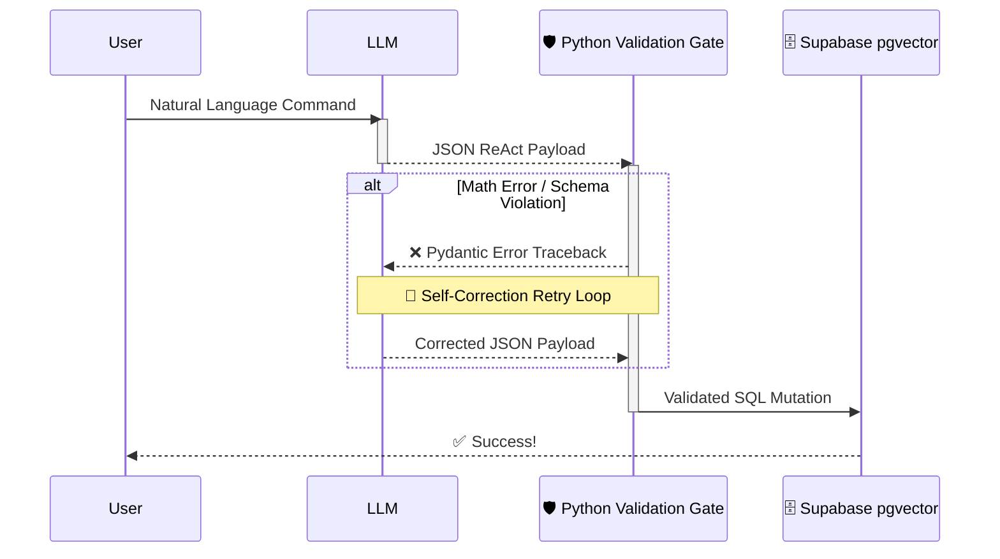

<div align="center">
  
# 🛡️ Deterministic AI Scaffolding Architecture

**Production-grade AI Orchestration using Pydantic, Supabase `pgvector`, and ReAct.**

[](https://www.python.org/)
[](https://gradio.app/)
[](https://supabase.com/)
[]()

</div>

---

## 🚀 The Problem: LLMs are Unreliable
Modern Large Language Models (LLMs) are incredibly smart, but they are intrinsically **probabilistic**. When building enterprise software, you cannot trust an LLM to directly mutate your production database. They suffer from:
1. **Hallucinations:** Inventing numbers or ignoring strict business rules.
2. **Schema Drift:** Outputting `{ "Name": "Star" }` instead of `{ "object_name": "Star" }`.
3. **Format Failure:** Outputting raw text instead of strictly parseable JSON.

## 🛠️ The Solution: Deterministic Scaffolding
This project implements a **Deterministic Safety Net** around the AI. The LLM is never allowed to directly touch the database. Instead, it must generate a structured JSON payload that is intercepted by a rigorously typed **Python Validation Gate (Pydantic)**. 

If the LLM makes a math error, violates a proprietary business rule, or breaks the schema, the backend **intercepts the crash** and forces the LLM into a **Self-Correction Retry Loop** until it fixes its own mistake.

---

## 🧠 Architecture Flow



---

## ✨ Core Features

| Feature | Description | Architecture Component |
|---------|-------------|------------------------|
| **ReAct Orchestration** | Forces the AI to output its `thought_process` before executing actions, preventing impulsive hallucinations. | `ReActPayload` Master Schema |
| **Semantic Vector RAG** | Uses OpenAI embeddings and Supabase `pgvector` to search databases by *concept* rather than exact keywords. | `match_celestial_objects` RPC |
| **A/B Evaluation UI** | A built-in UI tab to test an Unscaffolded LLM against the Scaffolded Pipeline in real-time. | `Gradio` Evaluation Tab |
| **Multi-Turn Retry Loops** | Automatically feeds Pydantic schema tracebacks and math errors back to the LLM for self-correction. | Backend Validation Gate |

---

## 🛑 When NOT to use Scaffolding
Deterministic Scaffolding is a "Hard Gate." It requires you to know the exact **Schema** and **Business Rules** ahead of time.

If your application needs to process **arbitrary, unstructured documents** (e.g., summarizing a random storybook or chatting with an unknown PDF), scaffolding will fail because you cannot build a deterministic Pydantic gate for an unknown schema.

**The Golden Rule:** 
Only use Scaffolding when the AI is touching **mission-critical infrastructure** (updating a database, paying an invoice, controlling a physical system). For open-ended chat, brainstorming, or unstructured RAG, turn off the scaffolding and let the LLM be creative.

---

## 🎯 Use Cases Demonstrated in this Repo

### 1. The Astronomy AI Assistant (ReAct + RAG)
An autonomous agent that manages an astronomical observation catalog. 
- **Prompt:** *"I'm looking for a dying star that is extremely volatile and bright. Flag it as Anomalous and set its priority to Critical."*
- **Action:** The AI reasons that you mean **Betelgeuse**, generates an embedding vector, performs a Cosine Similarity Search (`<=>`) in Supabase, and updates the database flawlessly.

### 2. PDF Data Extractor (Math Validation)
An ingestion pipeline that extracts tabular data from complex Invoices and Medical Records.
- **Trap:** The system enforces strict mathematical rules (e.g., `Quantity * Price = Total`).
- **Correction:** If the AI hallucinates a number or blindly copies a typo from the PDF, the Validation Gate throws a `ValueError`, forcing the AI to recalculate the math.

---

## 💻 Installation & Setup

### 1. Clone & Install Dependencies
```bash
git clone https://github.com/yourusername/ai-task-scaffold.git
cd ai-task-scaffold
pip install -r requirements.txt
```

### 2. Configure Environment Variables
Create a `.env` file in the root directory:
```env
GITHUB_TOKEN=your_github_personal_access_token
OPENAI_API_KEY=your_openai_api_key
SUPABASE_URL=https://your-project.supabase.co
SUPABASE_KEY=your_supabase_service_role_key
```
*(Note: This project uses GitHub Models for primary LLM inference, and OpenAI explicitly for generating `text-embedding-3-small` vector embeddings).*

### 3. Setup Supabase
Run the provided SQL migrations in your Supabase SQL Editor:
1. `supabase_schema.sql`: Creates the base tables.
2. `supabase_vector_upgrade.sql`: Enables `pgvector` and creates the Cosine Similarity RPC.
3. `supabase_astronomy.sql`: Seeds the initial data.

Generate your vector embeddings:
```bash
python generate_embeddings.py
```

### 4. Run the Application
```bash
python app.py
```
Open your browser to `http://127.0.0.1:7860`.

---

## 🧪 Try the A/B Scaffolding Test
Navigate to the **A/B Scaffolding Evaluation** tab in the UI. Upload `test_complex_invoice_no_note.pdf`. 

Watch as the **Unscaffolded (Raw LLM)** crashes and burns by blindly copying bad math, while the **Scaffolded AI** dynamically intercepts the error, reprimands the LLM, and successfully self-corrects!

---

<div align="center">
  <b>Built with ❤️ using Python, Pydantic, and Supabase.</b>
</div>
