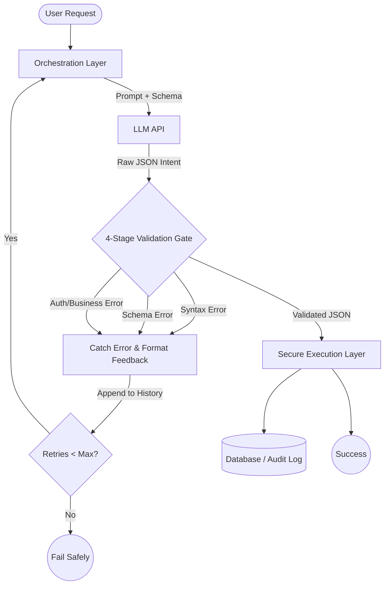

# 🛡️ LLM Scaffolding Architecture: Comprehensive Project Details

This document provides an in-depth, comprehensive look at the **LLM Scaffolding Architecture** project. It details the core philosophy, the exact technologies used, the application structure, and the step-by-step workflow of how it all ties together to provide a production-ready safety net for Large Language Models (LLMs).

---

## 1. Project Overview

**Project Name:** LLM Scaffolding Architecture (Example App: AI Observation Catalog)
**Primary Goal:** To demonstrate a production-grade, deterministic "scaffolding" around LLM agents, ensuring they cannot directly execute dangerous operations (like raw SQL) against a database.

### The Problem
Traditional AI agents are often granted direct access to databases or APIs, allowing them to construct and execute raw queries (e.g., SQL). Because LLMs are prone to "hallucinations" (inventing data, misunderstanding logic, or ignoring constraints), they can accidentally corrupt data, execute SQL injections, or crash systems by hallucinating table names or IDs.

### The Solution: Deterministic Scaffolding
This project implements a "Sandbox" model. The LLM is **never** allowed to touch the database directly. Instead:
1. The LLM translates user natural language into a **structured JSON intent**.
2. A deterministic Python **Validation Gate** intercepts this JSON.
3. The gate strictly validates the JSON against syntax rules, predefined schemas, business logic, and authorization constraints.
4. If the LLM makes a mistake, the gate blocks the execution and initiates a **Self-Correction Loop**, sending the error back to the LLM so it can try to fix its own mistake.
5. Only when all checks pass perfectly does a secure, parameterized backend function execute the request.

---

## 2. Core Features & Capabilities

The project demonstrates this architecture through three main interactive features:

1. **Sandboxed Chat & RAG (Astronomy Catalog):**
   A chatbot where users can ask to schedule, flag, or update celestial objects. The agent maps ambiguous user requests to specific tool actions (e.g., `UPDATE_STATUS`, `FLAG_ANOMALY`). If the request is too vague, it safely falls back to a `CLARIFICATION_NEEDED` action instead of guessing.
2. **PDF Data Extraction (Strict Validation):**
   Extracts structured data from messy PDFs (like Invoices or Patient Medical Records). It enforces mathematical validation (e.g., `Quantity * Price == Total`). If the LLM hallucinates the math or copies bad math from a corrupt document, the gate blocks it and forces recalculation.
3. **A/B Scaffolding Evaluation:**
   A side-by-side comparative tool. It runs the exact same document through an Unscaffolded AI (raw LLM output) and a Scaffolded AI (validation + retry loop) to visually prove how the scaffolding catches and corrects corrupted data before it reaches the database.

---

## 3. Technology Stack

The project leverages a modern, robust stack for both the user interface and the backend logic:

### Frontend / UI
* **Gradio (v6.0.0+):** The primary web framework used to build the interactive UI, chat interfaces, and data visualization. The project runs as a Hugging Face Space.
* **Custom HTML/CSS/JS:** Used heavily to override Gradio's default styling, providing a premium "Monochrome" theme with dynamic micro-animations (like hover glow effects on suggested prompts) and custom Kanban board layouts.

### AI & Language Models
* **OpenAI API / Hugging Face Hub:** Used to interact with the underlying Large Language Models.
* **ReAct Prompting Methodology:** The LLMs use a "Reasoning and Acting" approach. They output a `reasoning` string detailing their thought process before outputting the final JSON action.

### Backend & Validation
* **Python 3:** The core language for the orchestration and scaffolding logic.
* **Pydantic (v2.6.4+):** The backbone of the Validation Gate. It defines strict data schemas (using Python type hints) that the LLM's JSON output must adhere to.
* **PyPDF (v4.1.0+):** Used to parse and extract raw text from uploaded PDF documents in the extraction features.
* **Python-Dotenv:** For managing environment variables (like API keys and Database URLs) securely.

### Database & Storage
* **Supabase (PostgreSQL):** The backend database used to store the celestial objects and the `ai_action_log`. It is accessed via the `supabase` Python client (v2.3.6+). Operations are strictly parameterized to prevent injection.

---

## 4. How It Works: The 4-Stage Validation Gate

The core of the scaffolding is a multi-step pipeline. Here is the exact lifecycle of a user request:

### Step 1: User Input & Orchestration (`scaffold/agent.py`)
The user types a request (e.g., "Schedule Betelgeuse"). The orchestration script packages this with the conversation history and the required schemas, then calls the LLM wrapper (`scaffold/llm.py`).

### Step 2: The LLM Generates JSON
The LLM responds with a raw JSON string containing its `reasoning` and the `action` it wants to take.

### Step 3: The 4-Stage Gate (`scaffold/validate.py`)
This is where the deterministic scaffolding takes over.
1. **JSON Syntax Check:** Python attempts to parse the string into a dictionary. If it's malformed (missing brackets, trailing commas), it fails.
2. **Pydantic Schema Validation:** The parsed dictionary is validated against predefined Pydantic models (e.g., making sure `target_object_ids` is a list of strings, and `new_status` is a valid enum value like "Scheduled").
3. **Business Rules:** The gate checks the database to ensure the provided IDs actually exist in the catalog. The LLM cannot hallucinate fake IDs.
4. **Authorization:** The gate verifies that the current user has permission to modify those specific objects.

### Step 4: The Self-Correction Loop
If *any* of the stages in Step 3 fail, the execution is blocked. An error message detailing exactly what failed (e.g., "Validation Error: ID '123' does not exist") is sent *back* to the LLM. The LLM is prompted to fix its mistake. This loop repeats up to a maximum number of retries (usually 2).

### Step 5: Execution & Auditing (`scaffold/execute.py` & `scaffold/db.py`)
If the JSON passes all 4 stages of the gate, it is passed to the execution layer. The action is performed on the Supabase database using secure, parameterized queries. Finally, the entire transaction (including success/failure status, retries, and errors) is permanently logged to an audit table (`ai_action_log`) for reliability metrics tracking.

---

## 5. Advanced Feature: Forced Failure Testing

To prove the self-correction loop works, the application includes a "Force 1st-Pass Failure" setting. 
- A hidden business rule (a "Secret Word") can be dynamically injected into the Pydantic schema validation.
- Because the LLM isn't told about this rule in its initial prompt, its first attempt is guaranteed to fail the validation gate.
- The gate throws an error: `"Reasoning must contain the secret word: [WORD]"`.
- The orchestration layer passes this error back to the LLM.
- The LLM automatically self-corrects on its second attempt, updating its output to include the secret word, passing the gate, and succeeding.

---

## 6. Directory Structure Breakdown

* `app.py` - The Gradio frontend entry point. Contains UI definitions, state management, and custom CSS/JS.
* `scaffold/` - The core architecture module.
  * `agent.py` - Manages the LLM conversation loop, retry logic, and fallback handling.
  * `llm.py` - Interface for communicating with the LLM API provider.
  * `validate.py` - The deterministic 4-stage validation logic.
  * `execute.py` - The safe, parameterized database execution functions.
  * `db.py` - Supabase connection and metric logging utilities.
  * `schemas.py` - The Pydantic models that define the allowed intents.
  * `pdf_agent.py` / `pdf_llm.py` / `pdf_schemas.py` - Parallel logic dedicated to the PDF data extraction and math validation features.
* `*.sql` - Supabase schema definitions, vector upgrades, and seed data.
* `tests/` & `notebooks/` - Supporting development and testing resources.

## 7. Pipeline Workflow Diagram

### Core Orchestration & Self-Correction Pipeline
This diagram illustrates the primary loop that intercepts LLM outputs and forces self-correction when validation fails.

## Summary
By offloading critical logic from the non-deterministic LLM to a highly deterministic Python/Pydantic gate, this project ensures zero data corruption, explicit handling of ambiguity, and transparent, auditable AI actions, representing a massive leap in AI safety for production environments.
